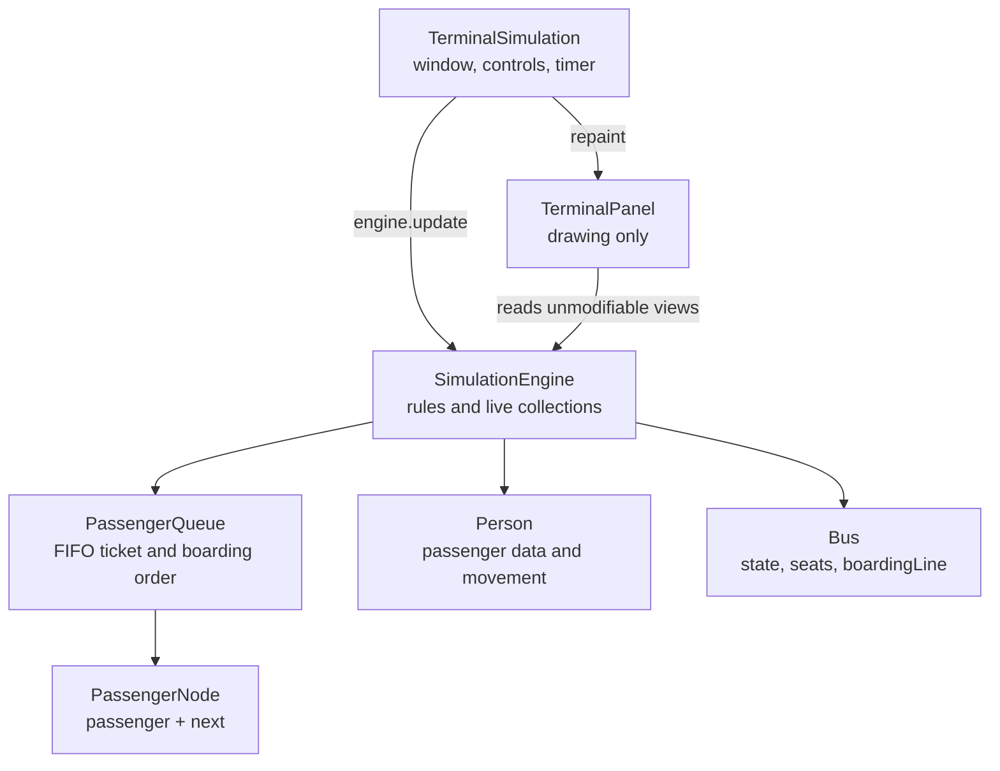

# Application Architecture

## Responsibility sentence

> `SimulationEngine` decides what happens; `TerminalPanel` draws the current state; `TerminalSimulation` connects the engine to Swing controls and timing.

## Boundaries

| Component | Changes simulation rules? | Draws pixels? | Owns Swing controls? |
|---|:---:|:---:|:---:|
| `SimulationEngine` | Yes | No | No |
| `TerminalPanel` | No | Yes | No |
| `TerminalSimulation` | Invokes engine methods | No | Yes |

> [!NOTE]
> This is useful separation of responsibilities, but the source does not label itself as strict MVC.

Open visually: [Application Architecture](https://github.com/PixelAlien0/Terminal-Simulation/blob/main/Defense/03%20-%20Program%20Flow/Application%20Architecture.md)
