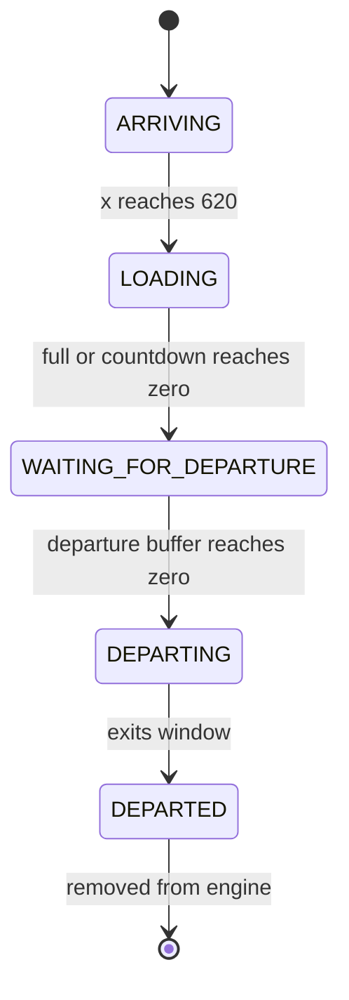

# Bus Journey

## What happens while loading

1. Try to reserve a matching priority passenger immediately.
2. If capacity remains, enqueue one matching regular passenger in `boardingLine`.
3. At the boarding interval, dequeue the front regular passenger and reserve a seat.
4. Start the countdown after at least one passenger reaches `SEATED_IN_BUS`.
5. Close when full or when the started countdown reaches zero.
6. Return anyone still in the boarding line to the platform.

> [!NOTE]
> **Capacity accounting**
> The engine uses `bus.getPassengerCount() + bus.boardingLine.size()` before adding another regular passenger, preventing reserved work from exceeding capacity.

Source: [TerminalSimulation](https://github.com/PixelAlien0/Terminal-Simulation/blob/main/src/TerminalSimulation.java) · [TerminalSimulation](https://github.com/PixelAlien0/Terminal-Simulation/blob/main/src/TerminalSimulation.java) · [TerminalSimulation](https://github.com/PixelAlien0/Terminal-Simulation/blob/main/src/TerminalSimulation.java) → `updateBuses`, `loadBus`
