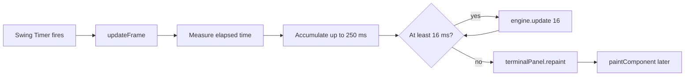

# One Timer Update

## Exact order inside `SimulationEngine.update`

1. `updateSpawning(elapsedMs)`
2. `updateBuses(elapsedMs)`
3. `updateTicketLane(...)` for priority, then regular
4. `movePassengers()`

> [!IMPORTANT]
> **Why the `while` loop?**
> The UI timer may be late. The accumulator runs zero or more fixed 16 ms engine steps so simulation timing stays stable, while the 250 ms cap avoids an extreme catch-up loop.

> [!WARNING]
> `repaint()` does not draw immediately. It asks Swing to schedule painting, which later calls `TerminalPanel.paintComponent`.

Source: [TerminalSimulation](https://github.com/PixelAlien0/Terminal-Simulation/blob/main/src/TerminalSimulation.java) → `updateFrame`; [TerminalSimulation](https://github.com/PixelAlien0/Terminal-Simulation/blob/main/src/TerminalSimulation.java) → `update`
