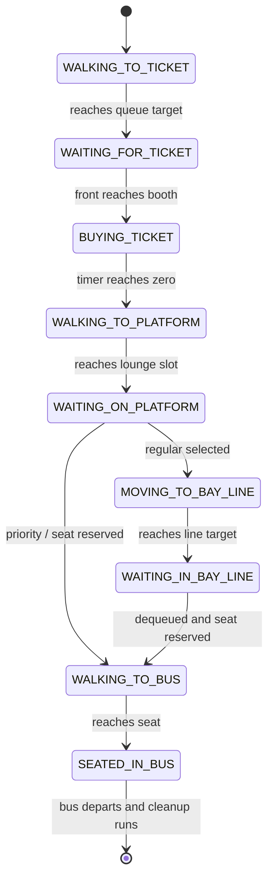

# Passenger Journey

## Method trace

| Stage | Method responsible |
|---|---|
| Create and ticket enqueue | `createPassenger` |
| Ticket service | `updateTicketLane` |
| Send to lounge | `sendToPlatform` |
| Match destination/type/state | `takePlatformPassenger` |
| Regular boarding order | `bus.boardingLine.enqueue/dequeue` |
| Seat assignment | `reserveSeat` |
| Arrival state changes | `movePassengers` |
| Final removal | `removeDepartedBuses` |

> [!IMPORTANT]
> **Three matching conditions**
> `takePlatformPassenger` requires matching priority type, state `WAITING_ON_PLATFORM`, and matching destination.

Open visually: [Passenger Journey](https://github.com/PixelAlien0/Terminal-Simulation/blob/main/Defense/03%20-%20Program%20Flow/Passenger%20Journey.md)
