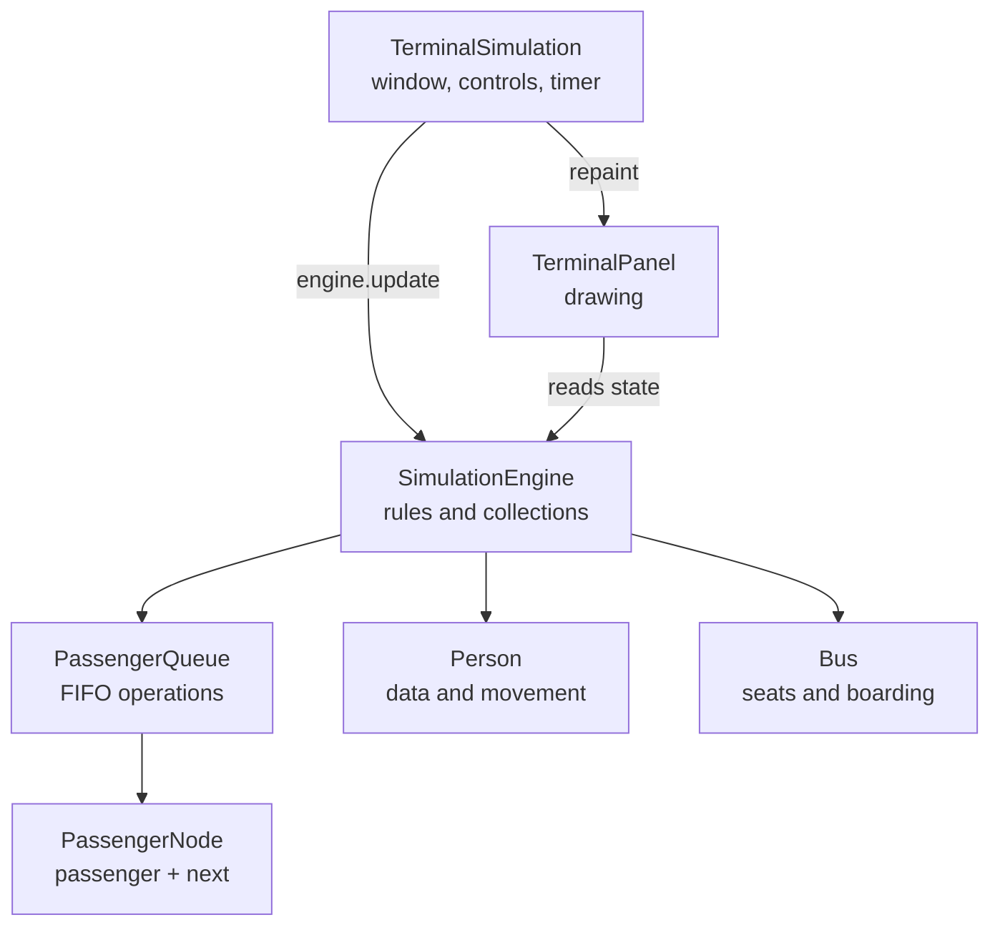

# Terminal Simulation Defense Study Guide

This section helps the group explain **how the existing Java program works**.
The main defense topic is the custom node-based FIFO queue. Everything links
back to the actual single-file source and tests on GitHub.

> [!IMPORTANT]
> Do not memorize every line. For each feature, explain which class receives
> the action, which method handles it, what data changes, and what appears next.

## Recorded presentation

Use the **[simple 6–7 minute presentation script](08%20-%20Recorded%20Presentation%20Script.md)**
to demonstrate the animation and explain the important code without using slides.

## Recommended study order

| Step | Lesson | Goal |
|---:|---|---|
| 1 | [Project in 60 Seconds](01%20-%20Start%20Here/Project%20in%2060%20Seconds.md) | Explain the project without reading. |
| 2 | [Vocabulary](01%20-%20Start%20Here/Vocabulary.md) | Understand the Java and DSA terms. |
| 3 | [Queue Mental Model](02%20-%20Queue/Queue%20Mental%20Model.md) | Draw `front`, `rear`, nodes, and links. |
| 4 | [Enqueue Trace](02%20-%20Queue/Enqueue%20Trace.md) and [Dequeue Trace](02%20-%20Queue/Dequeue%20Trace.md) | Explain every reference change. |
| 5 | [Passenger Journey](03%20-%20Program%20Flow/Passenger%20Journey.md) | Trace a passenger through the simulation. |
| 6 | [Class Guides](#class-guides) | Explain each class inside the single Java file. |
| 7 | [Rapid Recall](05%20-%20Practice/Rapid%20Recall.md) | Answer likely teacher questions aloud. |
| 8 | [Mock Defense](05%20-%20Practice/Mock%20Defense.md) | Practice follow-up “how” and “why” questions. |
| 9 | [Recorded Presentation Script](08%20-%20Recorded%20Presentation%20Script.md) | Rehearse what to show and say in the video. |

For a short schedule, follow the [Defense Study Route](01%20-%20Start%20Here/Defense%20Study%20Route.md).

## How the program connects

All of these are separate Java classes, but the group chose to store them in
one source file for easier navigation:

- [Complete Java source](../src/TerminalSimulation.java)
- [Queue regression tests](../test/PassengerQueueTest.java)
- [Simulation regression tests](../test/SimulationEngineTest.java)
- [Run instructions](../README.md#compile-and-run)
- [How to study this repository on GitHub](07%20-%20GitHub%20Study%20Guide.md)

## Queue lessons

- [PassengerNode](02%20-%20Queue/PassengerNode.md)
- [Queue Mental Model](02%20-%20Queue/Queue%20Mental%20Model.md)
- [Enqueue Trace](02%20-%20Queue/Enqueue%20Trace.md)
- [Dequeue Trace](02%20-%20Queue/Dequeue%20Trace.md)
- [Remove and Link Repair](02%20-%20Queue/Remove%20and%20Link%20Repair.md)
- [Queue Complexity](02%20-%20Queue/Queue%20Complexity.md)
- [Why There Are Two Ticket Queues](02%20-%20Queue/Why%20Two%20Ticket%20Queues.md)

## Program-flow lessons

- [Application Architecture](03%20-%20Program%20Flow/Application%20Architecture.md)
- [Startup Trace](03%20-%20Program%20Flow/Startup%20Trace.md)
- [One Timer Update](03%20-%20Program%20Flow/One%20Timer%20Update.md)
- [Passenger Journey](03%20-%20Program%20Flow/Passenger%20Journey.md)
- [Bus Journey](03%20-%20Program%20Flow/Bus%20Journey.md)

## Class guides

- [TerminalSimulation](04%20-%20Classes/TerminalSimulation.md)
- [SimulationEngine](04%20-%20Classes/SimulationEngine.md)
- [PassengerQueue](04%20-%20Classes/PassengerQueue.md)
- [Person](04%20-%20Classes/Person.md)
- [Bus](04%20-%20Classes/Bus.md)
- [TerminalPanel](04%20-%20Classes/TerminalPanel.md)

## Practice and evidence

| Practice | Evidence |
|---|---|
| [Rapid Recall](05%20-%20Practice/Rapid%20Recall.md) | [Queue Test Evidence](06%20-%20Evidence/Queue%20Test%20Evidence.md) |
| [Trace Drills](05%20-%20Practice/Trace%20Drills.md) | [Engine Test Evidence](06%20-%20Evidence/Engine%20Test%20Evidence.md) |
| [Mock Defense](05%20-%20Practice/Mock%20Defense.md) | [Honest Limitations](06%20-%20Evidence/Limitations.md) |

> [!TIP]
> Study actively: close the page, draw the queue, explain the method aloud, and
> then reopen the code to check your answer.
