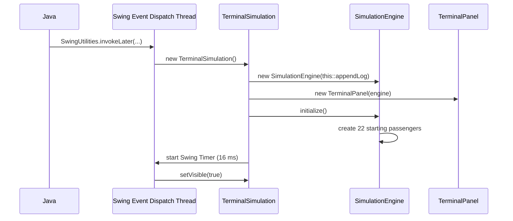
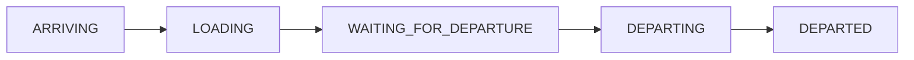

# Terminal Simulation: Code and Defense Guide

This guide is about the code that is actually in this repository. Its goal is
to help every group member explain how the program starts, how one update works,
where each passenger is stored, how states change, and how the cleanup rules
prevent bugs.

All classes and enums are now stored in the single source file
`src/TerminalSimulation.java`. They remain separate Java types with separate
responsibilities; only the file organization changed.

Do not memorize every line. For every feature, learn this four-part answer:

1. **Which class receives the action?**
2. **Which method handles it?**
3. **Which collection, field, or state changes?**
4. **What visible result happens next?**

Example:

> The Create Passenger button is handled by `TerminalSimulation`. It calls
> `SimulationEngine.createPassengerWithLog`, which creates a `Person`, adds it
> to one ticket-lane queue and the master passenger list, then recalculates the
> queue targets. The timer later moves that passenger toward the ticket booth.

That kind of answer proves that you understand the program instead of only
knowing its output.

## 1. The project in 60 seconds

The project is a Java Swing desktop simulation of a bus terminal. It has two
ticket lines, a platform, four bus bays, regular and priority passengers, and
buses for Davao and Tagum. The program repeatedly updates the simulation data
and then redraws the current state as pixel art.

The main separation is:

- `TerminalSimulation` creates the window and handles buttons and dialogs.
- `SimulationEngine` owns the live data and all simulation rules.
- `TerminalPanel` reads the engine and draws one frame.
- `Person` stores and moves one passenger.
- `Bus` stores one bus, its boarding line, and its 20 seats.
- The two enum files define the allowed passenger and bus states.
- `SimulationConfig` gives names to timing, capacity, and layout values.

The central idea is simple:

```text
user or timer -> TerminalSimulation -> SimulationEngine changes data
                                    -> TerminalPanel reads data and draws it
```

## 2. Source map: what calls what

| Class | Important methods | Called by | What it changes or returns |
|---|---|---|---|
| `TerminalSimulation.java` | `main`, constructor, `updateFrame` | Java and Swing | Creates the UI, advances the engine, requests painting |
| `TerminalSimulation.java` | `createPassenger`, `updatePassenger`, `deletePassenger`, `addBus`, `deleteBus` | Button listeners | Collects user input and calls the engine |
| `SimulationEngine` | `initialize`, `update` | Window constructor and timer | Creates initial data and runs simulation rules |
| `SimulationEngine` | passenger and bus CRUD methods | UI and tests | Mutates passengers, buses, queues, lines, and seats |
| `SimulationEngine` | `updateSpawning`, `updateBuses`, `updateTicketLane`, `movePassengers` | `update` | Advances one fixed simulation step |
| `PassengerNode` | constructor and `next` link | `PassengerQueue` | Stores one passenger in the linked queue chain |
| `PassengerQueue` | `enqueue`, `dequeue`, `peek`, `remove` | Engine, buses, and tests | Implements the assigned node-based FIFO queue |
| `Person` | constructor, `setTarget`, `stepTowardTarget`, `draw` | Engine and panel | Stores, moves, and draws one passenger |
| `Bus` | seat methods and `draw` | Engine and panel | Stores capacity and draws one bus |
| `TerminalPanel` | `paintComponent` and drawing helpers | Swing | Reads engine data and draws one frame |
| `PassengerQueueTest.java` | four queue tests | Test `main` and engine tests | Checks node links, FIFO, removal, reuse, and null rejection |
| `SimulationEngineTest.java` | six engine/panel tests | Test `main` | Checks cleanup, IDs, long runs, capacity, and painting |

The labeled sections in the source file are separate **classes** and **enums**,
not methods.
Methods are the named actions inside those classes, such as `update`,
`removePassenger`, and `draw`.

## 3. Exact startup path

When the program is launched, the calls happen in this order:



### Step-by-step explanation

1. Java looks for `public static void main(String[] args)` in
   `TerminalSimulation`.
2. `main` calls `SwingUtilities.invokeLater`. This schedules window creation on
   Swing's Event Dispatch Thread, or EDT.
3. The `TerminalSimulation` constructor creates the log, engine, drawing panel,
   controls, and frame layout.
4. The engine receives `this::appendLog`. That is a method reference, so the
   engine can report messages without directly knowing about `JTextArea`.
5. `engine.initialize()` logs the start and creates 22 passengers. Each gets a
   random route, and about 20% are priority passengers.
6. The constructor records `System.nanoTime()` and starts a Swing `Timer` with a
   16 ms delay.
7. After construction finishes, `setVisible(true)` shows the window.

All button events, timer events, and normal painting happen on the EDT. This
project therefore does not have background threads simultaneously modifying the
engine collections.

## 4. The heartbeat: one timer event and one engine step

The Swing timer calls `TerminalSimulation.updateFrame`. It does not blindly
assume that exactly 16 ms passed. It measures real elapsed time with
`System.nanoTime`, adds the time to `accumulatedMs`, and processes as many fixed
16 ms steps as needed.

```java
while (accumulatedMs >= SimulationConfig.FRAME_DELAY_MS) {
    engine.update(SimulationConfig.FRAME_DELAY_MS);
    accumulatedMs -= SimulationConfig.FRAME_DELAY_MS;
}
terminalPanel.repaint();
```

The elapsed time added during one timer event is capped at 250 ms. Without that
cap, returning from a long pause could cause a very large catch-up loop and make
the interface freeze again.

### Exact order inside `SimulationEngine.update`

```text
1. updateSpawning(elapsedMs)
2. updateBuses(elapsedMs)
3. updateTicketLane(priorityLane, elapsedMs)
4. updateTicketLane(regularLane, elapsedMs)
5. movePassengers()
```

The order matters. Bus selection occurs before passenger movement during a
step. A passenger who reaches the platform in step 10 changes to
`WAITING_ON_PLATFORM` near the end of that step, so a bus can select them in a
later step, not earlier in step 10.

After all required engine steps, `repaint()` requests a redraw. Swing later
calls `TerminalPanel.paintComponent`. `repaint` is a request; it does not call
the drawing code immediately.

## 5. Where the live data is stored

`SimulationEngine` owns the important working collections below:

| Data structure | Field | Contents | Why it fits |
|---|---|---|---|
| Custom `PassengerQueue` | `priorityLane.queue` | Priority ticket line | Node-based FIFO with front and rear |
| Custom `PassengerQueue` | `regularLane.queue` | Regular ticket line | Node-based FIFO with front and rear |
| `ArrayList<Person>` | `platform` | Ticketed passengers waiting or walking to the platform | Buses filter by route, type, and state, so this is not strict FIFO |
| `ArrayList<Person>` | `passengers` | Master list of all active passengers | Easy to iterate, search, list, move, and draw |
| `ArrayList<Bus>` | `buses` | All active buses | Small list that is repeatedly iterated |

Each `Bus` also owns:

- `Person[] seats`: a fixed array of 20 seat positions;
- `PassengerQueue boardingLine`: node-based FIFO line for regular passengers.

`PassengerNode` stores one `Person` and a `next` link. `PassengerQueue` stores
the `front`, `rear`, and `size`, so enqueue and dequeue are O(1). The complete
line-by-line explanation is in [CODE_WALKTHROUGH.md](CODE_WALKTHROUGH.md).

### The most important invariant

An active passenger must be in the engine's master `passengers` list. Their
current working location may also be one of these:

- one ticket queue;
- the platform list;
- one bus boarding line; or
- one bus seat.

A seat is reserved before the passenger physically reaches it. Therefore a
passenger can already be in `bus.seats` while their state is
`WALKING_TO_BUS`. When they reach the seat coordinate, the state becomes
`SEATED_IN_BUS`.

The master list and a location collection have different jobs. The master list
answers "which passengers still exist?" The other structures answer "where is
each passenger in the workflow?"

### Read-only collection views

Methods such as `passengers()` and `buses()` return
`Collections.unmodifiableList(...)`. The UI can read and iterate those lists,
but it cannot call `add` or `remove` through the returned reference. This helps
keep mutations inside `SimulationEngine`.

It is a read-only **view**, not a separate copied list, so it reflects later
engine changes.

## 6. Passenger states and exact regular-passenger journey

The allowed states come from `PassengerState`:

```mermaid
flowchart LR
    A["WALKING_TO_TICKET"] --> B["WAITING_FOR_TICKET"]
    B --> C["BUYING_TICKET"]
    C --> D["WALKING_TO_PLATFORM"]
    D --> E["WAITING_ON_PLATFORM"]
    E --> F["MOVING_TO_BAY_LINE"]
    F --> G["WAITING_IN_BAY_LINE"]
    G --> H["WALKING_TO_BUS"]
    H --> I["SEATED_IN_BUS"]
```



### A. Creation

For a manually created regular passenger going to Davao:

1. The button listener calls the window's `createPassenger` method.
2. Dialogs collect `Regular` and `Davao`.
3. The window calls `engine.createPassengerWithLog(false, "Davao")`.
4. `createPassenger` increments `passengerCounter` and creates an ID such as
   `P23`.
5. `normalizeDestination` converts valid capitalization to exactly `Davao` or
   `Tagum`; any unsupported route throws `IllegalArgumentException`.
6. The `Person` constructor starts the passenger at x = 10, around y = 350, in
   `WALKING_TO_TICKET`.
7. The engine enqueues the object at the rear of `regularLane.queue` and adds it
   to `passengers`.
8. `positionTicketQueues` assigns target coordinates to everyone in both
   ticket queues.

The quick Regular and Priority buttons use `createRandomPassenger`, which picks
a random destination. The detailed Create Passenger button uses dialogs and
also writes a CRUD message to the log.

### B. Walking and buying a ticket

`movePassengers` calls `stepTowardTarget()` on every active passenger. The
method moves x and y toward the target by at most four pixels per fixed update.
`Math.min` and `Math.max` prevent overshooting the target.

When the passenger first reaches their queue target:

- `stepTowardTarget()` returns `true`;
- `movePassengers` changes `WALKING_TO_TICKET` to
  `WAITING_FOR_TICKET`.

For the person at the front, `updateTicketLane` then targets the ticket booth.
Once the front person is at the booth, the engine changes their state to
`BUYING_TICKET` and sets `ticketTimerMs` to 320 ms. Each fixed update subtracts
16 ms. When it reaches zero:

1. `ticketLane.queue.dequeue()` removes the front person;
2. `sendToPlatform` adds them to the platform list;
3. their state becomes `WALKING_TO_PLATFORM`;
4. platform and ticket targets are recalculated; and
5. that lane waits another 320 ms before processing its next passenger.

The two ticket lanes are updated separately. Priority passengers do not block
the regular line, and both front clients can be processed during the same
simulation period.

### C. Platform waiting

`sendToPlatform` first removes the passenger from ticket queues and the platform list to
avoid duplicates. It then adds the passenger to `platform` if needed, clears
`assignedBus`, changes the state to `WALKING_TO_PLATFORM`, and calls
`positionPlatform`.

The platform list includes people still walking to their assigned platform
spot. A bus may only select an entry whose state is exactly
`WAITING_ON_PLATFORM`, so it cannot take someone before they arrive.

When the target is reached, `movePassengers` changes the state from
`WALKING_TO_PLATFORM` to `WAITING_ON_PLATFORM`.

### D. Regular boarding

While a matching bus is in `LOADING`, `loadBus` calls:

```java
takePlatformPassenger(bus.destination, false)
```

That method scans the platform from the front and selects the first passenger
who is regular, waiting, and has the same destination. It removes that person
using the iterator, so the loop does not cause a concurrent-modification error.

The selected regular passenger:

- gets state `MOVING_TO_BAY_LINE`;
- gets `assignedBus = bus`;
- is enqueued at the rear of `bus.boardingLine`;
- receives a line target from `positionBoardingLine`.

At the target, `movePassengers` changes the state to
`WAITING_IN_BAY_LINE`. Every 400 ms, the front regular passenger is dequeued and
passed to `reserveSeat`.

### E. Seat reservation and departure

`reserveSeat` asks `Bus.getRandomEmptySeat` for an empty array index. It then:

1. changes the state to `WALKING_TO_BUS`;
2. stores the bus in `assignedBus`;
3. stores the passenger in `bus.seats[seatIndex]`; and
4. sets the person's target to `bus.getSeatCoordinate(seatIndex)`.

At that coordinate, `movePassengers` changes the state to `SEATED_IN_BUS`.
The bus countdown starts only after the engine finds at least one seat occupant
whose state is `SEATED_IN_BUS`.

When the bus becomes full or its 60-second countdown reaches zero, the doors
close. After a 4.8-second departure buffer, the bus moves right. Its seated
passenger coordinates are updated with the moving bus. Once the bus is beyond
the window, `removeDepartedBuses` removes its seat occupants from the master
passenger list, clears the seats, and removes the bus.

## 7. How priority passengers differ

Priority passengers use the priority ticket queue. At a loading bus,
`loadBus` first asks for one matching priority passenger. If found, it calls
`reserveSeat` immediately.

Therefore priority passengers skip these regular-passenger states:

- `MOVING_TO_BAY_LINE`
- `WAITING_IN_BAY_LINE`

They still need a ticket, must reach the platform, need a matching destination,
walk to their seat, and become `SEATED_IN_BUS`.

In one engine update, a bus can select one priority passenger for a seat and one
regular passenger for its boarding line, as long as capacity reservations allow
it. "Priority" here is implemented by checking priority passengers first and
letting them bypass the boarding-line delay. It is not implemented with
`java.util.PriorityQueue`.

## 8. Bus creation and bus state flow

The allowed bus states come from `BusState`:



### Automatic bus creation

`updateSpawning` adds elapsed time to `busSpawnMs` only when bus operations are
running and there are fewer than four buses. At 19,200 ms, `spawnBus` finds all
free bays and randomly chooses one.

For automatically spawned buses:

- bays 1 and 2 serve Davao;
- bays 3 and 4 serve Tagum.

### Manual bus creation

The Add Bus button asks for a route and calls `engine.addBus(destination)`.
The engine finds free bays and randomly chooses one. A manually added Davao or
Tagum bus can use any free bay because its requested destination is passed to
`addBusAtBay`.

`addBusAtBay` rejects bay numbers outside 1-4 and occupied bays. A new bus starts
at x = 1400 in `ARRIVING` state. Its ID contains the line, A/B bay label, and a
unique B number.

### State processing in `updateBuses`

| State | Code action | Transition condition |
|---|---|---|
| `ARRIVING` | subtract 8 from x | At x <= 620, set x to 620 and state to `LOADING` |
| `LOADING` | call `loadBus` | Full or countdown reaches zero |
| `WAITING_FOR_DEPARTURE` | subtract elapsed time from buffer | At zero, change to `DEPARTING` |
| `DEPARTING` | add 6 to x and move seat coordinates | Beyond window width + 200, change to `DEPARTED` |
| `DEPARTED` | cleaned by `removeDepartedBuses` | Bus and completed passengers are removed |

If bus operations are stopped, `updateBuses` returns immediately. Existing
buses freeze in their current state, their timers stop, and automatic bus
spawn time stops advancing. Passenger walking and ticket processing continue.

## 9. How capacity is enforced

Every bus has a fixed `Person[20]` array. `null` means a seat is empty.
`getPassengerCount` counts non-null positions, and `isFull` checks whether the
count equals 20.

`getRandomEmptySeat` starts from a random array index and checks at most all 20
positions, wrapping with `% capacity`. It returns an empty index or -1 if none
exists.

Before adding a regular person to the boarding line, `loadBus` calculates:

```java
int reserved = bus.getPassengerCount() + bus.boardingLine.size();
```

This treats both occupied/reserved seats and the regular boarding line as
reserved capacity. A regular passenger is added only when `reserved` is less
than `capacity`.

If a priority passenger takes the last physical seat while a regular passenger
is still in the line, the bus becomes full and the waiting regular passenger is
sent back to the platform when the doors close. Capacity is still never more
than 20.

## 10. Exact button and CRUD behavior

### Passenger actions

| Button/action | Window method | Engine method | Main result |
|---|---|---|---|
| Quick Regular | listener in `createControls` | `createRandomPassenger(false)` | Random route, regular ticket queue |
| Quick Priority | listener in `createControls` | `createRandomPassenger(true)` | Random route, priority ticket queue |
| Create Passenger | `createPassenger` | `createPassengerWithLog` | Chosen type and destination, CRUD log |
| List Passengers | `showPassengers` | `passengers()` | Read-only table of active passengers |
| Update Passenger | `updatePassenger` | `findPassenger`, then `updatePassengerDestination` | Changes route and possibly detaches from a bus |
| Delete Passenger | `deletePassenger` | `removePassenger` | Removes every reference to that passenger |

### Passenger ID lookup

`promptId` trims input in the UI. The engine also calls `cleanId`, which rejects
null/blank IDs and trims spaces. `findPassenger` uses `equalsIgnoreCase`, so
`"  p12  "` can find passenger `P12`.

### Updating a destination

`updatePassengerDestination` first finds the passenger and normalizes the new
route.

- If the passenger is still in a ticket queue or unassigned on the platform,
  only the destination field changes. Their current workflow continues.
- If `detachFromBuses` finds them in a boarding line, seat, or with an assigned
  bus reference, it removes the old bus references and calls `sendToPlatform`.
  The passenger must then wait for a bus matching the new destination.

This prevents a passenger updated to Tagum from remaining assigned to a Davao
bus.

### Deleting a passenger safely

`removePassenger` performs cleanup in this order:

1. `findPassenger` locates the object.
2. `removeFromQueues` removes it from both ticket queues and the platform.
3. `detachFromBuses` removes it from every boarding line and seat and clears
   `assignedBus`.
4. `passengers.remove` removes it from the master list.
5. Queue and platform positions are recalculated.

Searching every possible location is intentional. Removing only from the master
list would leave a ghost passenger inside a bus.

### Bus actions

| Button/action | Window method | Engine method | Main result |
|---|---|---|---|
| Add Bus | `addBus` | `addBus` / `addBusAtBay` | Adds an arriving bus if a bay is free |
| Delete Bus | `deleteBus` | `removeBus` | Removes bus and returns its passengers |
| Stop/Resume Buses | `toggleBuses` | `toggleBusesStopped` | Freezes/resumes bus spawn, movement, loading, and timers |
| Close/Open Booth | `toggleTicketBooth` | `toggleTicketBooth` | Pauses/resumes ticket service and automatic passenger creation |

### Deleting a bus safely

`removeBus` removes the bus from the active bus list and calls
`returnBusPassengers`. That method:

1. dequeues boarding-line passengers into a temporary return list;
2. adds every non-null seat passenger not already in that list;
3. fills the seat array with null;
4. sends every still-active passenger back to the platform.

The temporary list prevents the same passenger from being returned twice while
keeping the production project focused on its assigned Queue structure.

### Closing the ticket booth

When closed, `updateTicketLane` returns before starting or advancing a ticket
transaction. Existing passengers may finish walking to their queue targets, but
ticket service is frozen. Automatic passenger creation also stops because
`updateSpawning` requires `ticketBoothOpen`. Manual creation buttons still work.

When reopened, `positionTicketQueues` refreshes the targets and processing
continues from the saved states and timers.

## 11. Collection mutation map

This table is useful when the teacher asks, "Where exactly is that object
added or removed?"

| Method | Adds to | Removes/clears from | Other important changes |
|---|---|---|---|
| `createPassenger` | enqueue into one ticket queue, add to `passengers` | nothing | assigns unique ID and route |
| `sendToPlatform` | `platform` if absent | both ticket queues and old platform entry | clears bus; state becomes `WALKING_TO_PLATFORM` |
| `takePlatformPassenger` | nothing | `platform` through `Iterator.remove` | returns first matching passenger |
| `loadBus` regular path | enqueue into `bus.boardingLine` | platform through helper; later dequeue front | assigns bus and line state |
| `reserveSeat` | one `bus.seats` index | nothing directly | assigns bus, seat target, walking state |
| `removePassenger` | nothing | queues, platform, bus lines, seats, master list | clears assignment |
| `updatePassengerDestination` | platform only if previously assigned | old bus line/seat if assigned | changes destination |
| `removeBus` | platform through helper | `buses`, bus line, all bus seats | clears each passenger assignment |
| `removeDepartedBuses` | nothing | completed seat passengers from master list, seats, bus | clears assignments |

## 12. Movement and rendering are separate

### Movement

The engine decides a target by calling `Person.setTarget`. The `Person` object
does not decide which queue or bus it should use. It only knows how to move
toward the given coordinates.

`stepTowardTarget` also advances a small four-frame walking animation. It
returns `true` when both x and y equal the target. `movePassengers` uses that
return value to perform state transitions.

### Rendering

Swing calls `TerminalPanel.paintComponent`. It:

1. calls `super.paintComponent` to clear the previous frame;
2. creates a separate `Graphics2D` context;
3. draws the background, waiting areas, ticket booth, and schedule board;
4. draws all buses;
5. copies and sorts passengers by y coordinate;
6. draws passengers who are not `SEATED_IN_BUS`;
7. draws the status panel; and
8. disposes the copied graphics context in `finally`.

Sorting by y means people lower on the screen are drawn later, creating simple
visual depth. The copied list is important: sorting it does not reorder the
engine's master passenger list.

The panel reads through engine getters. It never decides ticket order, assigns
a bus, reserves a seat, or deletes data. That rule belongs to the engine.

### Why the pixel art uses many lines

`Person.draw`, `Bus.draw`, and the `TerminalPanel` drawing helpers contain many
`fillRect`, `drawRect`, `fillOval`, color, font, and coordinate statements.
Those lines describe the artwork. They add to the source line count but do not
make the simulation algorithm equally complicated.

No external image files are used. The art is recreated from drawing commands
on every paint.

## 13. Data structures and algorithms you should be able to defend

| Concept | Where used | What the code demonstrates |
|---|---|---|
| Linked node | `PassengerNode` | Stores one passenger and the next-node reference |
| FIFO queue | Both ticket queues and every bus boarding line | `enqueue` at rear, `peek` at front, `dequeue` from front |
| Filtered waiting list | `platform` | Scans for the first matching route, type, and waiting state; not claimed as strict FIFO |
| Dynamic array list | `platform`, `passengers`, `buses` | Stores objects that need iteration, search, or filtered selection |
| Fixed array | `Bus.seats` | Exactly 20 indexed seats; null means empty |
| Linear search | `findPassenger`, `findBus`, `takePlatformPassenger` | Checks objects until a match is found |
| State machine | `PassengerState`, `BusState`, switch statements | Behavior depends on a limited current state |
| Circular scan | `getRandomEmptySeat` | Starts randomly and wraps with modulo |
| Safe removal during iteration | Platform and departed-bus iterators | Uses `Iterator.remove` instead of modifying the list directly |
| De-duplication | Temporary list in `returnBusPassengers` | Avoids returning the same reference twice during cleanup |
| Sorting | Y-sort in `paintComponent` | Painter's-order visual depth |
| Fixed time step | `updateFrame` accumulator | Runs logic in consistent 16 ms units |

### Complexity answers

Let `n` be the active passenger count and `b` the active bus count.

- custom queue `enqueue`, `dequeue`, `peek`, `isEmpty`, and `size`: O(1).
- custom queue CRUD `remove` and `contains`: O(q), where q is queue length.
- `findPassenger`: O(n) linear search.
- `findBus` and `isBayFree`: O(b). Here b is at most four.
- `takePlatformPassenger`: O(n) in the worst case.
- `movePassengers`: O(n) per update.
- `positionPlatform`: O(n).
- `getRandomEmptySeat`: O(20), which is effectively O(1) because capacity is
  fixed at 20.
- counting or checking a bus: O(20), also effectively O(1).
- passenger rendering sort: O(n log n), followed by O(n) drawing.

The automatic passenger cap is 160, so these simple searches are reasonable for
this educational simulation. More complicated indexing would add code without
providing a meaningful benefit at this scale.

## 14. What the tests prove

`PassengerQueueTest` directly checks the assigned DSA. `SimulationEngineTest`
runs those queue checks first, then six engine/panel checks. Both runners throw
`AssertionError` when a condition is false.

| Test | Setup and assertion | Bug or rule protected |
|---|---|---|
| `queueUsesLinkedNodesAndFifoOrder` | Checks P1 -> P2 -> P3 links and dequeue order | Real node chain and FIFO behavior |
| `removalRepairsFrontMiddleAndRearLinks` | Removes requested passengers from different positions | CRUD cleanup preserves links/front/rear |
| `emptyQueueCanBeReused` | Empties and enqueues again | Front and rear reset correctly |
| `nullPassengerIsRejected` | Attempts `enqueue(null)` | Every node contains a valid passenger |
| `deletingPassengerClearsSeatAndWorkingList` | Seats a person, deletes them, checks master list and seat | No ghost passenger after delete |
| `deletingBusReturnsPassengerToPlatform` | Seats a person, deletes bus, checks state, assignment, platform | No stranded passenger after bus delete |
| `updatingAssignedPassengerRequeuesForNewDestination` | Seats Davao passenger, changes to Tagum | No old-route bus reference |
| `identifiersAreTrimmedAndCaseInsensitive` | Searches with spaces and lowercase | Friendly ID matching |
| `simulationMaintainsInvariantsOverTime` | Runs 7,500 updates and checks references/capacity | Long-run consistency |
| `terminalPanelPaintsHeadlessly` | Paints into a `BufferedImage` | Drawing can complete without a visible window |

The tests use `new Random(7)`. A fixed seed repeats the same random choices, so a
failure can be reproduced.

The long-run invariant check verifies that every passenger in a boarding line or
seat also exists in the master list and points back to that same bus. It also
checks that no bus exceeds capacity.

## 15. Code-focused defense questions and answers

Practice answering in your own words. Start with the responsible class and
method, then name the data or state that changes.

### Startup and timing

#### 1. Where does execution begin?

In `TerminalSimulation.main`. It schedules construction with
`SwingUtilities.invokeLater`, then the constructed frame is made visible.

#### 2. Why is `SwingUtilities.invokeLater` used?

Swing expects component creation and UI changes on the Event Dispatch Thread.
It also means timer actions, button actions, and normal painting use the same UI
thread in this program.

#### 3. What creates the 22 initial passengers?

The `TerminalSimulation` constructor calls `engine.initialize`. That method
loops 22 times and calls `createRandomPassenger`.

#### 4. What exactly happens every timer event?

`updateFrame` measures elapsed nanoseconds, converts them to milliseconds, caps
catch-up at 250 ms, runs zero or more 16 ms engine updates, and requests a panel
repaint.

#### 5. Why can one timer event call `engine.update` more than once?

The timer may arrive late. The accumulator catches up using consistent 16 ms
steps instead of passing one unpredictable large step to the engine.

#### 6. In what order does one engine update run?

Spawning, bus updates, priority ticket lane, regular ticket lane, then passenger
movement.

#### 7. Why does the order of `update` matter?

It determines when a new state becomes visible to another rule. For example, a
person who reaches the platform during `movePassengers` can be selected by a bus
on a later update.

### Passenger data and flow

#### 8. Where is every active passenger stored?

In `SimulationEngine.passengers`, the master `ArrayList`. A passenger can also
appear in one workflow location such as a ticket queue, platform, bus line, or
seat.

#### 9. How is a passenger ID created?

`createPassenger` increments `passengerCounter`, then uses `"P" +
passengerCounter`.

#### 10. How does the program know whether a passenger is regular or priority?

The `Person.isPriority` boolean is set by the constructor and is final. The
engine uses it to choose the ticket lane and boarding behavior.

#### 11. How does a newly created passenger know where to walk?

After adding the person to a lane, `positionTicketQueues` calculates each queue
target and calls `Person.setTarget`.

#### 12. What changes a passenger from walking to waiting?

`Person.stepTowardTarget` reports arrival. `SimulationEngine.movePassengers`
then switches the passenger state, such as `WALKING_TO_PLATFORM` to
`WAITING_ON_PLATFORM`.

#### 13. Who is served first in a ticket line?

`updateTicketLane` uses `queue.peek()` and later `queue.dequeue()`, so the front
passenger is served first: FIFO.

#### 14. Is priority service a Java `PriorityQueue`?

No. The program has two custom node-based FIFO ticket queues. Priority boarding
is a rule in `loadBus` that checks priority passengers first and skips their bus
boarding queue.

#### 15. Can both ticket lines serve someone at the same time?

Yes. `update` calls `updateTicketLane` separately for both lanes during every
fixed step. Each lane has its own client and transaction delay.

#### 16. What prevents a bus from taking a passenger who is still walking to the platform?

`takePlatformPassenger` requires the state to equal
`WAITING_ON_PLATFORM`, not just membership in the platform list.

#### 17. What three conditions must match in `takePlatformPassenger`?

Passenger type, state `WAITING_ON_PLATFORM`, and destination equal to the bus
destination.

#### 18. How does a regular passenger enter a bus?

`loadBus` removes the first matching regular person from the platform, assigns
the bus, enqueues them at the rear of `boardingLine`, waits for the boarding
interval, then dequeues the front and calls `reserveSeat`.

#### 19. How does a priority passenger enter a bus?

`loadBus` finds a matching priority platform passenger first and calls
`reserveSeat` directly, bypassing `boardingLine`.

#### 20. At what moment is a passenger counted by `getPassengerCount`?

As soon as `reserveSeat` stores the reference in `bus.seats`, even while the
passenger state is still `WALKING_TO_BUS`.

#### 21. When does that passenger become fully seated?

After `stepTowardTarget` reaches the seat coordinate, `movePassengers` changes
`WALKING_TO_BUS` to `SEATED_IN_BUS`.

### Bus flow and capacity

#### 22. How does the program prevent two buses from using one bay?

`freeBays` checks bays 1-4, and `isBayFree` scans active buses for a matching
`bayId`. `addBusAtBay` rejects an occupied bay.

#### 23. How does an arriving bus reach its bay?

In the `ARRIVING` switch case, `updateBuses` subtracts 8 from x per fixed step.
At x <= 620 it snaps to 620 and changes state to `LOADING`.

#### 24. What starts the 60-second loading countdown?

`loadBus` scans the seat array. When at least one passenger in a seat has state
`SEATED_IN_BUS`, it sets `countdownStarted` to true.

#### 25. What closes a bus?

Either `bus.isFull()` or a started countdown reaching zero. The state then
changes from `LOADING` to `WAITING_FOR_DEPARTURE`.

#### 26. What happens to regular passengers still in line when doors close?

The engine repeatedly dequeues the front until the boarding queue is empty,
sending each waiting passenger back to the platform.

#### 27. Why are seats an array instead of another unlimited list?

The bus has an exact capacity and indexed screen coordinates. A fixed 20-element
array directly represents the 20 seats.

#### 28. How does `getRandomEmptySeat` avoid going outside the array?

It checks `(start + offset) % capacity`, so the index wraps from the end back to
zero.

#### 29. What happens during `DEPARTING`?

`moveBus` adds 6 to the bus x coordinate and recalculates each seat passenger's
screen position so they move with the bus.

#### 30. What finally removes a departed passenger from the simulation?

`removeDepartedBuses` clears each seat passenger's bus reference and removes
them from the master passenger list when their bus state is `DEPARTED`.

#### 31. What exactly freezes when Stop Buses is pressed?

`updateBuses` returns, so movement, loading, countdowns, and departures freeze.
Automatic bus spawn timing also pauses. Ticket processing and passenger walking
continue.

### CRUD and cleanup

#### 32. Why is List Passengers the Read part of CRUD?

`showPassengers` reads `engine.passengers()` and builds a non-editable JTable
showing ID, destination, type, state, and assigned bus.

#### 33. What locations are checked when deleting a passenger?

Both ticket queues, platform, every bus boarding line, every bus seat, and the
master passenger list.

#### 34. What bug would happen if deletion only used `passengers.remove`?

A bus line or seat could still reference the deleted object, creating a ghost
passenger and an incorrect capacity count.

#### 35. What happens if a seated passenger's destination is updated?

`detachFromBuses` removes them from the old seat and clears the assignment.
`sendToPlatform` requeues them to wait for the new matching route.

#### 36. What happens if a ticket-line passenger's destination is updated?

They are not assigned to a bus, so only the destination changes. They continue
through the same ticket line and later wait for the new route.

#### 37. How does deleting a bus avoid returning the same passenger twice?

It dequeues boarding passengers into a temporary `ArrayList` and adds a seat
passenger only when that exact reference is not already in the list.

#### 38. Why does `takePlatformPassenger` use an iterator?

It needs to remove the current element during iteration. `Iterator.remove`
performs that safely without a `ConcurrentModificationException`.

#### 39. Is the CRUD data saved after the program closes?

No. CRUD operates on in-memory Java collections. There is no database or file
persistence in this version.

#### 40. Can outside UI code add directly to the list returned by `passengers()`?

No. The engine returns an unmodifiable view, so collection mutation stays in the
engine methods.

### Drawing and tests

#### 41. Who calls `paintComponent`?

Swing calls it after a repaint request or when the component needs redrawing.
The project should not call `paintComponent` directly.

#### 42. Why call `super.paintComponent` first?

It clears and prepares the panel so pixels from older frames do not remain.

#### 43. Why copy the passenger list before sorting it?

The panel needs y-order only for drawing. Sorting a copy prevents visual order
from changing the engine's master list order.

#### 44. Why are seated passengers not drawn as walking sprites?

`paintComponent` skips passengers whose state is `SEATED_IN_BUS`; they are
represented as part of the bus rather than standing on top of it.

#### 45. Does drawing change who boards a bus?

No. Drawing only reads state. `SimulationEngine` performs selection, assignment,
state transitions, and cleanup.

#### 46. How does the long-running test check references?

It builds a set from the master passenger list, then verifies every passenger in
each bus line and seat is known and has `assignedBus` pointing to that bus.

#### 47. Why use `Random(7)` in tests?

It makes random choices repeatable, which makes failures reproducible.

#### 48. How is rendering tested without opening a window?

The test creates a `BufferedImage`, gets its `Graphics2D`, sizes a
`TerminalPanel`, and paints into the image.

### Design and honest limitations

#### 49. Why is `SimulationEngine` separate from `TerminalPanel`?

It keeps rules independent of painting. Cleanup and state behavior can be tested
without requiring a visible GUI.

#### 50. Is this strict MVC?

It is MVC-inspired: models are `Person` and `Bus`, the view is
`TerminalPanel`, and the engine/window share controller responsibilities. It
does not use an MVC framework.

#### 51. Why are there more lines than the original single-file program?

The current version separates responsibilities, adds complete cleanup and tests,
and keeps programmatic pixel-art drawing readable. More physical lines do not
automatically mean a more complicated execution path.

#### 52. What are the main limitations?

Only two routes and four bays are modeled; layout coordinates are mostly fixed;
data is not persistent; and terminal behavior is simplified for education.

### Queue and node implementation

#### 53. What makes `PassengerNode` a real node?

It stores one `Person` reference as its data and one `PassengerNode next`
reference as its link to the following queue element.

#### 54. What do `front` and `rear` mean?

`front` points to the next passenger who will be dequeued. `rear` points to the
most recently enqueued node. Both are null when the queue is empty.

#### 55. How does `enqueue` work?

It creates a new node. In an empty queue, both front and rear become that node.
Otherwise, the old rear's `next` points to the new node and rear moves forward.

#### 56. How does `dequeue` work?

It saves the front passenger, advances front to `front.next`, reduces size, and
returns the saved passenger. If the last node left, it also resets rear to null.

#### 57. Why are enqueue and dequeue O(1)?

The queue directly stores both ends, so neither operation needs to traverse the
node chain.

#### 58. Why does the custom queue also have an O(n) `remove` method?

Normal service is FIFO, but CRUD deletion may target a passenger in the middle.
The method must traverse nodes and repair the front, middle, or rear link.

#### 59. Where is the custom queue used?

It implements the regular and priority ticket lines and every bus's regular
boarding line. These processes add at the rear and serve from the front.

#### 60. Why is the platform an `ArrayList` instead of the assigned queue?

Buses filter the platform by destination, priority type, and waiting state,
which can skip unmatched people. That collection is therefore not one strict
global FIFO service line.

#### 61. Why keep enums after adding nodes?

Nodes control passenger order. Enums restrict valid passenger and bus states.
They solve different problems, and Java keeps their types separate.

#### 62. How is this different from the group assigned a singly linked list?

Both can use one-way node links internally, but our public behavior is the Queue
ADT: enqueue at rear, peek/dequeue at front, and FIFO service. A linked-list
assignment normally focuses on general insertion, deletion, and traversal at
arbitrary positions.

## 16. Trace drills: predict what happens next

Try answering these before reading the answer key.

### Drill A: passenger reaches the platform

A Davao regular passenger is in `platform` with state
`WALKING_TO_PLATFORM`. A Davao bus is loading. During this update the passenger
reaches the platform target. Can that bus select the passenger in the same
update?

### Drill B: deleting a walking-to-bus passenger

A passenger has state `WALKING_TO_BUS`, has an assigned bus, and already appears
in one seat index. The user deletes the passenger. Which references are removed?

### Drill C: closing the booth mid-transaction

The front passenger is `BUYING_TICKET` with 160 ms remaining. The booth is
closed for five seconds and reopened. Did the passenger finish during closure?

### Drill D: deleting a bus

A bus has two seated passengers and three regular passengers in its boarding
line. The bus is manually deleted. Where do those five people go?

### Drill E: full bus with a waiting line

A priority passenger takes the last empty seat while a regular passenger is
still in the bus boarding line. What happens to the regular passenger?

### Answer key

- **A:** No. `updateBuses` runs before `movePassengers`. The state becomes
  `WAITING_ON_PLATFORM` near the end of the update, so selection can happen on a
  later update.
- **B:** `removeFromQueues` checks queues and platform; `detachFromBuses`
  removes the seat reference and clears `assignedBus`; then the master list
  reference is removed.
- **C:** No. `updateTicketLane` returns while the booth is closed, so the ticket
  timer remains at 160 ms. It resumes after reopening.
- **D:** `returnBusPassengers` clears the line and seats, then sends all five
  active passengers back to the platform with no assigned bus.
- **E:** The full-bus close condition runs, clears the boarding line, and sends
  that regular passenger back to the platform.

## 17. A code-centered demonstration plan

During the demonstration, narrate methods instead of only clicking buttons:

1. Start the program and say: "`main` constructs the UI on the EDT;
   `initialize` creates 22 passengers; the Swing timer drives fixed updates."
2. Create a regular passenger and say which two collections receive the object.
3. Point out `WALKING_TO_TICKET`, `BUYING_TICKET`, and platform states in List
   Passengers.
4. Add a route-matching bus and explain `ARRIVING` to `LOADING`.
5. Compare one regular boarding-line path with one priority direct-seat path.
6. Update an assigned passenger's destination and explain detachment and
   requeueing.
7. Delete a passenger or bus and name every location that gets cleaned.
8. Stop buses and explain why ticket and walking behavior can continue.

If animation timing makes a live example slow, explain the method and state
change while it runs. The code path is more important than waiting silently.

## 18. How to discuss AI use honestly

A safe and truthful answer is:

> We used AI as a development assistant for review, refactoring, documentation,
> and test ideas. We did not treat generated code as automatically correct. We
> compiled it, ran regression checks, traced the actual methods and collections,
> and studied how the current version works. We can explain the startup path,
> update order, state transitions, data structures, cleanup rules, and current
> limitations ourselves.

Do not claim that every line was written manually if that is not true. The
teacher's condition is understanding. Prove that understanding by naming the
method, data change, state transition, and next result.

## 19. Minimal Java vocabulary for explaining this code

| Word | Meaning in this project |
|---|---|
| Class | A type such as `Person`, `Bus`, or `SimulationEngine` |
| Object | One created instance, such as passenger P23 |
| Field | Stored data, such as `destination`, `state`, or `seats` |
| Method | An action, such as `update`, `reserveSeat`, or `draw` |
| Constructor | Initializes a new object; it has the class name |
| Enum | A fixed set of states, such as `PassengerState` |
| Node | One linked element containing a passenger and a `next` reference |
| Queue | FIFO structure with enqueue at rear and dequeue at front |
| Collection | A structure holding objects, such as a list or array |
| `final` | The reference/value is not reassigned after initialization |
| `null` | No object reference; for example, an empty seat |
| Lambda | A short event action, such as `event -> updateFrame()` |
| Method reference | Passes an existing method, such as `this::appendLog` |
| Override | Replaces inherited behavior, such as `paintComponent` |

## 20. Compile, run, and test

From the repository folder in PowerShell:

```powershell
New-Item -ItemType Directory -Force out
$sources = (Get-ChildItem src -Filter *.java).FullName
javac --release 8 -encoding UTF-8 -d out $sources
java -cp out TerminalSimulation
```

Compile production code and tests, then run all checks:

```powershell
$files = @(
    (Get-ChildItem src -Filter *.java).FullName
    (Get-ChildItem test -Filter *.java).FullName
)
javac --release 8 -encoding UTF-8 -d out $files
java -ea -cp out PassengerQueueTest
java -ea -cp out SimulationEngineTest
```

Expected result:

```text
PassengerQueueTest: all checks passed
SimulationEngineTest: all checks passed
```

## 21. Final one-page memory sheet

| If asked about... | Start your answer with... |
|---|---|
| Program startup | `main` -> `invokeLater` -> constructor -> `initialize` -> Swing Timer |
| One update | spawning -> buses -> two ticket lanes -> movement -> repaint |
| All active people | master `ArrayList<Person> passengers` |
| Queue structure | `PassengerNode` data + `next`; `PassengerQueue` front + rear + size |
| Ticket order | node-based FIFO using `enqueue`, `peek`, and `dequeue` |
| Platform selection | first matching type + waiting state + route |
| Regular boarding | platform -> enqueue bus line -> 400 ms -> dequeue front -> seat |
| Priority boarding | platform -> direct seat reservation |
| Capacity | fixed `Person[20]` seat array plus reserved line count |
| Walking | engine sets target; `Person.stepTowardTarget` moves; engine changes state |
| Bus lifecycle | arriving -> loading -> closing buffer -> departing -> removed |
| Passenger deletion | queues + platform + every bus line/seat + master list |
| Bus deletion | collect unique passengers + clear bus + return them to platform |
| Destination update | change route; detach and requeue if bus-assigned |
| Drawing | `paintComponent` reads engine; it does not apply simulation rules |
| Tests | node links, FIFO, queue removal/reuse, cleanup, IDs, 7,500-step invariants, capacity, headless paint |
| AI use | assistant used; team verified, tested, traced, and understands code |

The strongest defense answer is not a definition. It is a trace:

> "This method is called, it changes this collection and state, then this method
> handles the next step."
