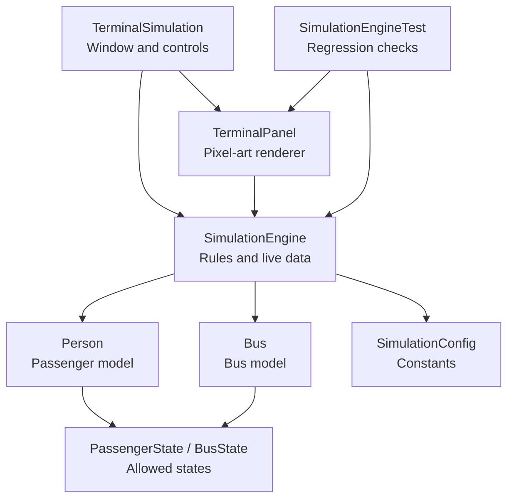
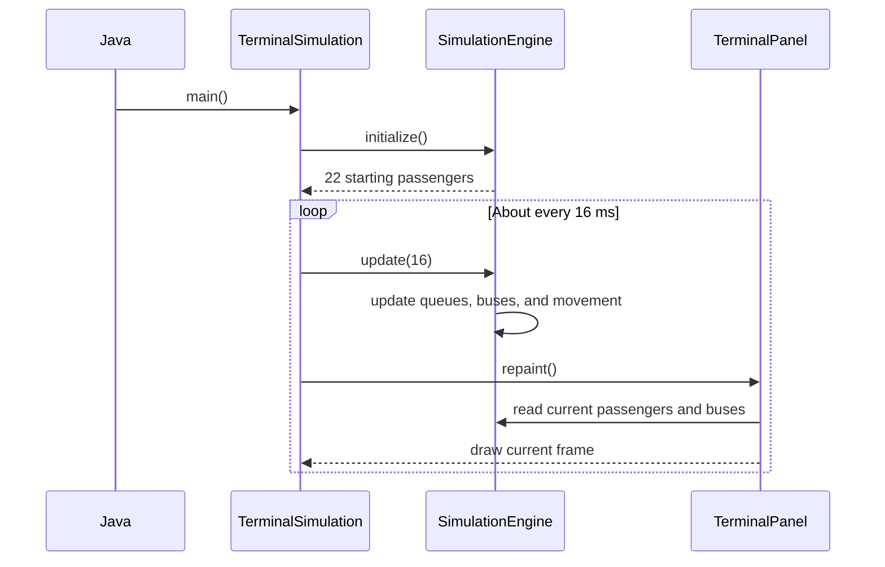
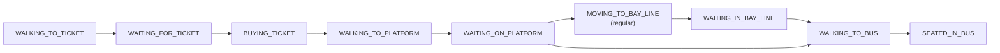
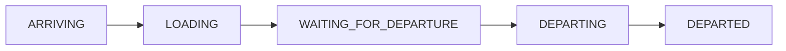

# Terminal Simulation Defense Study Guide

This guide explains the project for team members who are new to Java. Study the
flow and responsibilities instead of memorizing every line.

## 1. Project summary

The project is a Java Swing desktop simulation of a bus terminal. It shows:

- regular and priority passengers;
- two ticket queues;
- a platform waiting area;
- four bus bays;
- buses arriving, loading, and departing;
- Davao and Tagum destinations;
- passenger CRUD and bus-management controls; and
- pixel-art animation drawn with Java graphics.

### Short defense description

> Our project simulates how passengers move through a bus terminal. Passengers
> obtain tickets, wait on the platform, board a matching bus, and leave with that
> bus. We used Java Swing for the interface, object-oriented classes for
> passengers and buses, enum-based states for the workflow, and a simulation
> engine to keep the rules separate from the graphics.

## 2. Architecture at a glance



The design is inspired by Model-View-Controller:

- **Model:** `Person`, `Bus`, and their states.
- **View:** `TerminalPanel` draws the simulation.
- **Controller and rules:** `SimulationEngine` changes the model.
- **Application/UI controller:** `TerminalSimulation` handles buttons and dialogs.

It is not a strict MVC framework, but the responsibilities are separated in a
similar way.

## 3. Java basics needed for the defense

### Class

A class is a blueprint. `Person` describes the information and behavior that
every passenger has.

### Object

An object is one instance created from a class. Passenger `P1` and passenger
`P2` are different `Person` objects.

### Field

A field stores an object's data. Examples are `Person.id`, `Person.x`, and
`Bus.destination`.

### Method

A method performs an action. Examples are `removePassenger`, `loadBus`, and
`draw`.

### Constructor

A constructor initializes a new object. It has the same name as its class:

```java
Person(String id, String destination, int startX, int startY,
       boolean isPriority, int arrivalOrder)
```

### Enum

An enum is a limited set of valid values. A passenger cannot have a random text
state; the state must be one of the values in `PassengerState`.

### List

A list stores multiple objects.

- `ArrayList` is useful for general collections and indexed access.
- `LinkedList` is useful here for queues where the first person is processed
  and removed.

### Array

An array has a fixed size. Each bus uses a `Person[]` array with 20 positions,
representing 20 seats.

### Inheritance

`TerminalSimulation extends JFrame`, so it inherits the behavior of a Swing
window. `TerminalPanel extends JPanel`, so it can be placed inside that window
and painted.

### Method overriding

`TerminalPanel` overrides `paintComponent`. Swing calls this method whenever
the panel needs to be redrawn.

### Lambda expression

This is a short way to provide an action:

```java
event -> createPassenger()
```

It means: when the event occurs, call `createPassenger`.

### final

`final` means something should not be reassigned or extended.

- A final class cannot be subclassed.
- A final field cannot point to a different object after construction.
- A `static final` primitive or string is normally a constant.

### private and package-private

- `private` members are only accessible inside their class.
- Members without an access modifier are package-private and can be used by
  other classes in the same package.

The project uses one simple default package, which is acceptable for a small
school application. A larger project would normally use named packages.

## 4. What happens when the program starts

1. Java calls `TerminalSimulation.main`.
2. `SwingUtilities.invokeLater` schedules UI creation on Swing's Event
   Dispatch Thread.
3. The `TerminalSimulation` constructor creates the log, engine, drawing panel,
   and buttons.
4. `engine.initialize()` creates 22 starting passengers.
5. A Swing `Timer` requests updates approximately every 16 milliseconds.
6. `updateFrame` calculates elapsed time.
7. `engine.update(16)` advances the simulation in fixed steps.
8. `terminalPanel.repaint()` asks Swing to draw the latest state.



## 5. File-by-file explanation

### SimulationConfig.java

This file contains values that configure the simulation.

Important constants:

| Constant | Meaning |
|---|---|
| `FRAME_DELAY_MS` | Length of one simulation step: 16 ms |
| `MAX_FRAME_CATCH_UP_MS` | Prevents huge update loops after a freeze |
| `WINDOW_WIDTH`, `WINDOW_HEIGHT` | Starting window size |
| `LOG_MAX_LINES` | Maximum event-log size |
| `MAX_PASSENGERS` | Automatic spawning limit |
| `PASSENGER_SPEED` | Pixels moved during one simulation step |
| `BUS_CAPACITY` | Seats per bus |
| `TICKET_SERVICE_MS` | Ticket transaction duration |
| `BOARDING_INTERVAL_MS` | Delay between regular boarders |
| `BUS_LOADING_COUNTDOWN_MS` | Loading countdown: 60 seconds |

Why use constants?

- The meaning is clearer than writing unexplained numbers.
- A value can be changed in one place.
- It reduces accidental inconsistencies.

The constructor is private because this class is not supposed to be instantiated.
It only holds constants.

### PassengerState.java

This enum lists every valid passenger state:



Priority passengers normally go from the platform directly to
`WALKING_TO_BUS`. Regular passengers first join the bay line.

Why use an enum instead of strings?

- The compiler catches spelling mistakes.
- Only valid states can be assigned.
- A switch statement can handle each state clearly.

### Person.java

`Person` is the passenger model and passenger sprite.

Important fields:

| Field | Purpose |
|---|---|
| `id` | Unique ID such as P1 |
| `destination` | Davao or Tagum |
| `isPriority` | Whether priority rules apply |
| `arrivalOrder` | Number displayed on the sprite |
| `x`, `y` | Current screen position |
| `targetX`, `targetY` | Destination position |
| `state` | Current PassengerState |
| `assignedBus` | Bus being boarded, or null |
| `ticketTimerMs` | Remaining ticket transaction time |

Important methods:

- `setTarget(x, y)` changes where the passenger should walk.
- `stepTowardTarget()` moves toward that target and returns `true` upon
  arrival.
- `draw(Graphics2D)` draws the person's body, number, destination letter,
  priority star, shadow, and ticket progress bar.

The walking animation changes `animationFrame`, which creates a small body bob
and alternating leg movement.

### BusState.java

The five bus states are:



- **ARRIVING:** The bus moves from the right toward its bay.
- **LOADING:** Passengers can be selected and seated.
- **WAITING_FOR_DEPARTURE:** Doors are closed and a short buffer runs.
- **DEPARTING:** The bus moves to the right.
- **DEPARTED:** The engine removes the bus and its completed passengers.

### Bus.java

`Bus` stores bus information and draws the bus sprite.

Important fields:

| Field | Purpose |
|---|---|
| `busId` | Display ID such as Davao Exp A (B1) |
| `destination` | Route served by the bus |
| `bayId` | Bay number 1–4 |
| `state` | Current BusState |
| `seats` | Fixed 20-position passenger array |
| `boardingLine` | Regular passengers waiting near the bus |
| `countdownMs` | Remaining loading time |
| `departureBufferMs` | Short pause before movement |

Important methods:

- `getRandomEmptySeat` begins at a random index and searches for an empty seat.
- `isFull` checks whether all 20 seats are occupied.
- `getPassengerCount` counts non-null seats.
- `getSeatCoordinate` converts a seat index to an on-screen position.
- `draw` draws the body, windows, wheels, door, route color, capacity, and
  countdown.

A `null` seat means the seat is empty.

### SimulationEngine.java

This is the central rules class. It owns the changing simulation data.

Main collections:

| Collection | Contents |
|---|---|
| Priority ticket lane | Priority passengers waiting for tickets |
| Regular ticket lane | Regular passengers waiting for tickets |
| `platform` | Ticketed passengers waiting for buses |
| `passengers` | Master list of active passengers |
| `buses` | Active buses |

The nested `TicketLane` class lets both ticket lanes use the same processing
method. Each lane stores its queue position, row direction, and transaction
delay.

#### The update method

```java
void update(int elapsedMs) {
    updateSpawning(elapsedMs);
    updateBuses(elapsedMs);
    // update both ticket lanes
    movePassengers();
}
```

This is the simulation heartbeat. It performs four main jobs:

1. Spawn passengers and buses when their intervals are reached.
2. Update every bus according to its current state.
3. Process both ticket lanes.
4. Move passengers and change their states when they arrive.

#### Passenger creation

`createPassenger`:

1. increments the passenger counter;
2. creates a unique ID;
3. validates the destination;
4. creates the `Person`;
5. adds the person to the correct ticket lane;
6. adds the person to the master list; and
7. recalculates queue positions.

#### Ticket processing

`updateTicketLane` always looks at the first person in the lane:

1. Move the first person to the booth.
2. Change the state to `BUYING_TICKET`.
3. Reduce the ticket timer.
4. Remove the person from the ticket queue when finished.
5. Send the person to the platform.
6. Apply a short transaction delay before the next customer.

This follows FIFO: first in, first out.

#### Bus loading

`loadBus` performs the loading rules:

1. Find one matching priority passenger and reserve a seat directly.
2. Find one matching regular passenger and add them to the boarding line.
3. At the boarding interval, move the first regular passenger into a seat.
4. Start the countdown after somebody is fully seated.
5. Close the bus when it is full or the countdown reaches zero.
6. Return anyone still in the boarding line to the platform.

The destination must match:

```java
passenger.destination.equals(bus.destination)
```

#### Safe passenger deletion

`removePassenger` removes the passenger from:

- both ticket lanes;
- the platform;
- every bus boarding line;
- every bus seat; and
- the master passenger list.

This fixes the old problem where a deleted passenger could remain counted inside
a bus.

#### Safe bus deletion

`removeBus` first collects passengers from its boarding line and seats. It
clears the bus references and sends those passengers back to the platform.

This fixes the old problem where deleting a bus stranded its passengers.

#### Destination update

If the passenger is already assigned to a bus, changing the destination:

1. removes them from the old bus;
2. clears `assignedBus`;
3. returns them to the platform; and
4. lets a bus matching the new destination select them later.

This prevents a Tagum passenger from remaining on a Davao bus.

#### Automatic limits

Automatic passenger generation stops when there are 160 active passengers. This
prevents unlimited memory and queue growth. Manual buttons can still demonstrate
passenger creation.

### TerminalPanel.java

`TerminalPanel` is the view. It reads engine data but does not decide who
boards a bus.

`paintComponent` draws layers in this order:

1. terminal and road background;
2. bay waiting areas;
3. ticket booth;
4. departure board;
5. buses;
6. passengers; and
7. status panel.

Passengers are sorted by Y coordinate before drawing. A lower passenger is drawn
later, which gives a simple sense of depth.

Important Swing rule:

```java
super.paintComponent(graphics);
```

This clears the previous frame correctly. The method also creates a copy of the
`Graphics2D` context and disposes it afterward so drawing settings do not leak.

`EnvironmentDecoration` is kept in the same file because flowers and trash
cans are only used by this renderer.

### TerminalSimulation.java

This is the application window and user-input layer.

Responsibilities:

- configure the JFrame;
- create and style buttons;
- show dialogs;
- display the passenger table;
- maintain the event log;
- start the Swing timer; and
- call the engine every frame.

#### Fixed-step timing

`updateFrame` uses `System.nanoTime()` to measure real elapsed time. It adds
that time to an accumulator and processes 16 ms simulation steps.

Why not assume every timer event is exactly 16 ms?

The operating system may deliver a timer event late. Measuring elapsed time
keeps the simulation more consistent. Catch-up is capped at 250 ms so a long
freeze does not cause a huge loop.

#### Why SwingUtilities.invokeLater?

Swing components should be created and changed on the Event Dispatch Thread.
Using `invokeLater` follows Swing's thread-safety rule.

#### Passenger table

`showPassengers` creates a non-editable, sortable `JTable`. It displays each
passenger's ID, destination, type, state, and assigned bus.

#### Log limit

`appendLog` removes old lines after the log exceeds 500 lines. This prevents
the text area from growing forever.

### SimulationEngineTest.java

This is a small test program without an external testing framework.

It checks:

- deleting a passenger clears their bus seat;
- deleting a bus returns passengers to the platform;
- updating a destination clears the old bus assignment;
- IDs ignore spaces and capitalization;
- a long 7,500-tick simulation preserves capacity and assignments; and
- the panel can render into an off-screen image.

`new Random(7)` gives tests repeatable random behavior. The same seed produces
the same sequence.

## 6. Complete passenger journey

Example: a regular passenger going to Davao.

1. `createPassenger(false, "Davao")` creates P1.
2. P1 enters the regular ticket queue.
3. The movement update brings P1 to the queue position.
4. P1 reaches the booth and becomes `BUYING_TICKET`.
5. The ticket timer ends and P1 moves to the platform.
6. A loading Davao bus searches the platform.
7. P1 joins that bus's regular boarding line.
8. The boarding interval expires.
9. The engine reserves an empty seat.
10. P1 walks to the seat and becomes `SEATED_IN_BUS`.
11. The bus becomes full or reaches the end of its countdown.
12. The bus closes, waits briefly, and departs.
13. After it moves off-screen, the engine removes the bus and its completed
    passengers.

For a priority passenger, steps 7 and 8 are skipped; the passenger receives an
available seat directly.

## 7. CRUD explanation

CRUD means Create, Read, Update, and Delete.

| CRUD operation | Project example |
|---|---|
| Create | Create Passenger button |
| Read | List Passengers table |
| Update | Change a passenger's destination |
| Delete | Delete Passenger button |

Bus controls also support creation and deletion.

Important limitation: the CRUD data is in memory. Closing the application resets
the simulation because there is no database or file persistence.

If the teacher asks whether it is “real CRUD,” answer:

> Yes, it performs CRUD operations on the live in-memory passenger collection.
> It does not provide persistent database CRUD because persistence was outside
> the simulation's scope.

## 8. Object-oriented programming concepts in the project

### Encapsulation

Each class owns a specific responsibility. The engine controls simulation
transitions, while the panel controls drawing.

### Abstraction

The UI calls `engine.removePassenger(id)` without needing to know every queue
and seat that must be cleaned.

### Inheritance

`TerminalSimulation` inherits from `JFrame`, and `TerminalPanel` inherits
from `JPanel`.

### Composition

The window contains an engine and a panel. A bus contains passengers in its seat
array.

### Polymorphism and overriding

`TerminalPanel.paintComponent` overrides the JPanel method. Swing can treat the
object as a JPanel while using the project's custom drawing implementation.

## 9. Common defense questions and suggested answers

### 1. What is the main objective of the project?

To visually simulate passenger processing and bus boarding in a terminal while
demonstrating Java Swing, object-oriented programming, queues, state transitions,
animation, and CRUD operations.

### 2. Why did you choose Java?

Java provides object-oriented features, collections, timers, and Swing graphics
in its standard libraries. It is suitable for a self-contained desktop
simulation.

### 3. Why Swing instead of a website?

The project is a desktop Java application. Swing provides buttons, dialogs,
tables, timers, and custom painting without requiring a web server or browser
framework.

### 4. What is the role of SimulationEngine?

It owns the simulation data and business rules. It decides when passengers move,
buy tickets, board, or return to the platform. It also controls bus state
changes.

### 5. What is the role of TerminalPanel?

It draws the current state. It does not decide simulation rules.

### 6. Why separate the engine from the panel?

Separating logic and graphics makes the rules easier to test and prevents UI
code from directly manipulating all queues and seats.

### 7. Why use enums?

Enums restrict states to known values and make state transitions clearer and
safer than free-form strings.

### 8. Why use LinkedList for queues?

Passengers are normally processed from the front in FIFO order. LinkedList
supports queue-style addition, first-element access, and removal.

### 9. Why use ArrayList for buses and the master passenger list?

These collections are frequently iterated and do not require constant removal
from the front, so ArrayList is simple and appropriate.

### 10. How is bus capacity enforced?

Each bus has a fixed 20-position seat array. A passenger only receives an empty
seat, and `isFull` checks whether all positions are occupied.

### 11. How does priority boarding work?

During loading, the engine first searches for one matching priority passenger and
reserves a seat directly. A regular passenger enters the boarding line and waits
for the boarding interval.

### 12. Can a passenger board the wrong destination?

No. The engine compares the passenger and bus destination before selecting the
passenger.

### 13. What happens if a passenger's destination changes after boarding?

The engine removes the passenger from the old bus and returns them to the
platform so a correct bus can select them.

### 14. What happens when a bus is manually deleted?

Its seated and waiting passengers are collected, detached from the bus, and
returned to the platform before the bus is removed.

### 15. What bug existed in the original passenger deletion?

The old code removed the passenger from common queues but could leave them in a
bus seat or boarding line. The new engine cleans every possible location.

### 16. Why use a Swing Timer instead of Thread.sleep?

`Thread.sleep` on Swing's UI thread would freeze buttons and painting. A Swing
Timer schedules small update events without blocking the interface.

### 17. What is the Event Dispatch Thread?

It is Swing's main UI thread. Button actions, timer events, and painting happen
there, which prevents multiple threads from changing the same UI state
simultaneously.

### 18. Why use System.nanoTime?

It measures elapsed time reliably and is not affected by changes to the
computer's wall clock.

### 19. What does repaint do?

It requests a future redraw. Swing later calls `paintComponent`; repaint does
not directly draw immediately.

### 20. Why call super.paintComponent?

It clears and prepares the panel correctly before custom drawing, preventing old
frames from remaining on the screen.

### 21. How is the pixel art created?

It uses `Graphics2D` methods such as `fillRect`, `fillOval`,
`drawRoundRect`, colors, fonts, and coordinates. No external sprite files are
required.

### 22. How do you avoid unlimited growth?

Automatic passengers are capped at 160, departed passengers are removed, buses
are removed after leaving, and the event log is capped at 500 lines.

### 23. Is the data saved after closing?

No. This version is an in-memory simulation. Database or file persistence would
be a future feature.

### 24. How did you test the application?

We created regression checks for the cleanup bugs, destination changes, ID
normalization, capacity, long-running state behavior, and off-screen rendering.
The source also compiles with Java 8 compatibility.

### 25. Why is the project still more than one thousand lines?

A significant portion is programmatic pixel-art drawing. The remaining code
separates the UI, models, and rules and includes safety handling. We chose
readability over compressing multiple operations into hard-to-read one-line
statements.

### 26. What are the current limitations?

- Only Davao and Tagum routes are supported.
- There are four fixed bays.
- Most artwork uses fixed coordinates.
- Data is not persistent.
- Traffic and ticket behavior are simplified rather than based on real terminal
  measurements.

### 27. What would you improve next?

Possible improvements include responsive scaling, configurable routes and bays,
saved simulation data, adjustable speed, statistics, accessibility options, and
a packaged executable JAR.

### 28. Is the design thread-safe?

The interactive application keeps engine updates, button actions, and painting
on Swing's Event Dispatch Thread. It avoids background threads that could mutate
the collections at the same time.

### 29. What is null used for?

`null` means no object is assigned. For example, a null seat is empty and a
null `assignedBus` means the passenger is not currently assigned to a bus.

### 30. Why use a deterministic Random in tests?

A fixed seed makes the same random choices repeat across test runs, making
failures reproducible.

## 10. Questions where you should answer honestly

Do not claim features that the project does not have.

| Question | Honest answer |
|---|---|
| Does it use a database? | No, it uses in-memory collections |
| Does it run on GitHub Pages? | No, Swing is a desktop UI |
| Is the layout fully responsive? | No, it has a minimum size and some adaptive drawing, but much of the pixel art uses fixed coordinates |
| Is it a real transport model? | It is an educational simulation with simplified rules |
| Does every team member need to memorize all code? | No, but everyone should understand the overall flow and their assigned section |
| Is it strict MVC? | It is MVC-inspired, not a framework-enforced MVC implementation |

Honest technical answers are stronger than pretending.

## 11. Suggested defense presentation

### Part 1: Introduction — 30 seconds

> Our system is a Java Swing bus-terminal simulation. It demonstrates passenger
> queues, ticket processing, priority boarding, bus capacity, route matching,
> CRUD operations, animation, and object-oriented design.

### Part 2: Architecture — 1 minute

Show the architecture diagram and explain:

- TerminalSimulation handles controls.
- SimulationEngine handles rules.
- TerminalPanel handles drawing.
- Person and Bus hold model data.

### Part 3: Passenger flow — 1 minute

Explain the passenger-state diagram from ticket queue to bus seat.

### Part 4: Bus flow — 1 minute

Explain the five BusState values and the departure countdown.

### Part 5: Demonstration — 2 minutes

1. Start the application.
2. Add regular and priority passengers.
3. Add a bus.
4. Show ticket and platform movement.
5. Open the passenger table.
6. Update a passenger destination.
7. Delete a passenger or bus and explain safe cleanup.
8. Pause and resume operations.

### Part 6: Improvements and testing — 1 minute

Explain the original cleanup bugs, fixed timing, capped growth, and regression
tests.

## 12. Suggested group assignments

If you have four members:

1. **Member 1:** Introduction, Java basics, and architecture.
2. **Member 2:** Passenger states, ticket queues, and CRUD.
3. **Member 3:** Bus states, capacity, priority boarding, and timing.
4. **Member 4:** Swing UI, pixel-art rendering, testing, and improvements.

Every member should still know:

- the project objective;
- the role of every file;
- the basic passenger journey;
- the basic bus journey;
- one original bug and its fix; and
- at least five common defense answers.

## 13. Study plan for beginners

### First 20 minutes

Read sections 1–4 and learn the basic Java terms.

### Next 30 minutes

Study the passenger and bus state diagrams. Explain each arrow aloud without
looking.

### Next 30 minutes

Divide the file-by-file section among members. Each member teaches their section
to the others.

### Next 20 minutes

Run the application and trace one passenger from creation to departure.

### Final 30 minutes

Ask each other random questions from section 9. Require answers in your own
words, not memorized sentences.

## 14. Fast cheat sheet

| Item | One-sentence explanation |
|---|---|
| `main` | Starts the Swing application on the UI thread |
| `TerminalSimulation` | Window, buttons, dialogs, timer, and log |
| `SimulationEngine` | Owns queues, buses, passengers, and rules |
| `TerminalPanel` | Draws the current engine state |
| `Person` | Passenger data, movement, and sprite |
| `Bus` | Bus data, seats, boarding line, and sprite |
| `PassengerState` | Valid passenger workflow stages |
| `BusState` | Valid bus lifecycle stages |
| `SimulationConfig` | Named timing and layout values |
| `LinkedList` | FIFO ticket and platform queues |
| `ArrayList` | Active passenger and bus collections |
| `Person[] seats` | Fixed 20-seat bus capacity |
| `update` | Advances the entire simulation |
| `paintComponent` | Draws one visual frame |
| `repaint` | Requests Swing to draw again |
| `assignedBus == null` | Passenger currently has no bus |

## 15. Compile, run, and test

### PowerShell

```powershell
New-Item -ItemType Directory -Force out
$sources = (Get-ChildItem src -Filter *.java).FullName
javac -encoding UTF-8 -d out $sources
java -cp out TerminalSimulation
```

### Regression checks

```powershell
$files = @(
    (Get-ChildItem src -Filter *.java).FullName
    (Get-ChildItem test -Filter *.java).FullName
)
javac -encoding UTF-8 -d out $files
java -ea -cp out SimulationEngineTest
```

Expected test output:

```text
SimulationEngineTest: all checks passed
```

## Final advice for the defense

- Understand the flow; do not memorize source lines.
- When asked “how,” name the method and explain the state change.
- Use the diagrams to describe sequences.
- If you do not know an exact detail, explain the responsible class and say you
  would verify the implementation.
- Do not claim a database, web deployment, or full responsiveness.
- Emphasize that the engine-rule separation made the important cleanup bugs
  testable.
